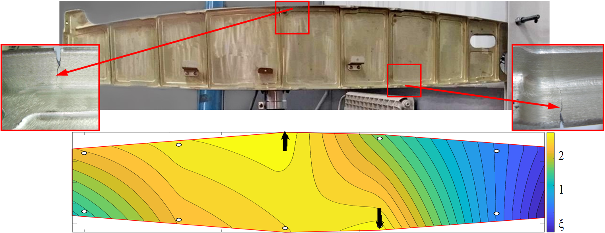
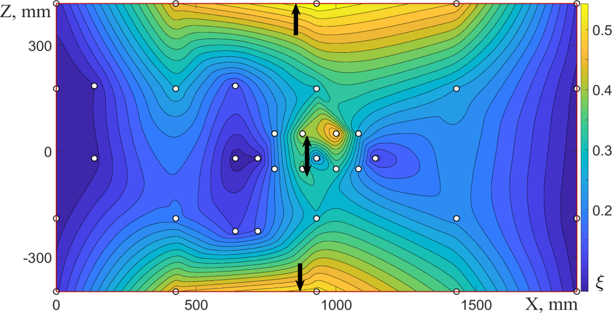

## Назначение
Программа предназначена для поиска возможных мест расположения дефектов в виде трещин. 

## Исходные данные
1. Временные сигналы датчиков аксселерометров, соответствующие одному из собственных тонов конструкции. 
2. Последовательность координат, характеризующая ключевую геометрию анализируемой модели.

## Принцип работы
В основе алгоритма лежит разложение сигнала в ряд Фурье с последующей обработкой для выделение из сигнала нелинейных искажений, характеризующих диссипацию энергии вблизи берегов трещины в ходе колебательного процесса.

## Примеры работы
* Нервюра крыла самолета *RRJ-95*:

* Нервюра крыла самолета *СУ-27*:

* Авиационной панель с надрезом в центральной части и дефектами в виде трещин в стрингерах:

## Апробация
Результаты работы программы вошли в [диссертацию](https://www.nstu.ru/files/dissertations/avtoreferat_zhukov_15484089174.pdf) Жукова Е. П.
